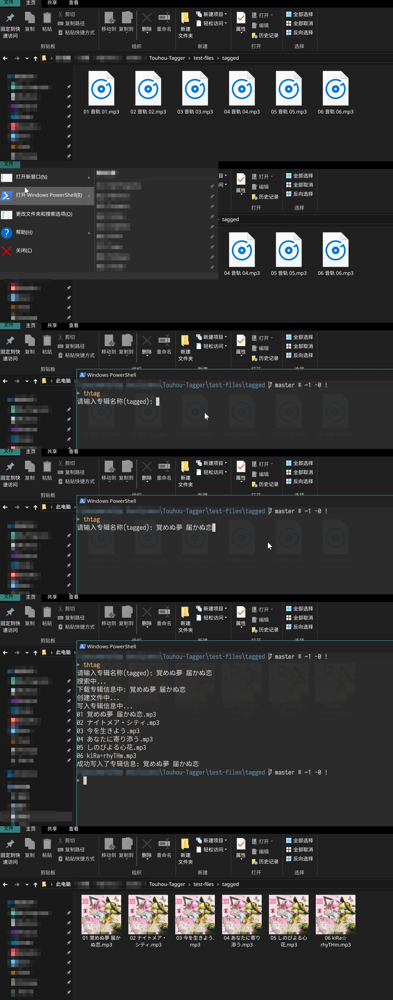

# Touhou Tagger
从 [THBWiki](http://thwiki.cc/首页) 自动填写东方Project CD曲目信息.

## 安装
```powershell
npm install -g touhou-tagger
```
## 使用
假设您为一个专辑的音乐建立了单独的文件夹, 在专辑文件夹中运行:
```powershell
thtag
```
启动后会询问专辑名称, 如果留空直接回车就取文件夹的名字; 如果按照这个名称没有**精确匹配**的专辑(**精确匹配**在 THBWiki 中表现为输入到搜索框回车能直接跳转到词条), 则会列出以此名称在 THBWiki 中的搜索结果, 可以继续选择一项作为专辑信息. (有精确匹配的话会直接开始下载专辑信息)

<details><summary><strong>图片示例: bunny rhyTHm - 覚めぬ夢 届かぬ恋</strong></summary>

</details>

## 选项
### 保存封面为单独的文件
(文件名为 `cover`, 类型取决于 THBWiki 上的资源)
```powershell
thtag -c
```
或
```powershell
thtag --cover
```
### 更换数据源
(默认为 `thb-wiki`)
```powershell
thtag -s 'xxx'
```
或
```powershell
thtag --source 'xxx'
```
## 魔改示例
(需要已安装 `Node.js` 及 `Typescript`)
### 安装依赖项
```powershell
npm install
```
### 添加其他数据源
在`src/core/metadata/`中添加文件`xxx.ts`, 实现`MetadataSource`接口:
```TypeScript
import { MetadataSource } from './metadata-source'
import { Metadata } from './metadata'

export const xxx: MetadataSource = {
  // 搜索专辑, 返回 string 表示精确匹配, 返回 string[] 表示未找到精确匹配, 内容是根据 albumName 搜索得到的结果
  async resolveAlbumName(albumName: string): Promise<string[] | string> { /* ... */ }
  // 下载专辑信息, 返回 Metadata[]
  async getMetadata(albumName: string): Promise<Metadata[]> { /* ... */ }
}
```
然后在`src/core/metadata/source-mappings.ts`中添加对应项:
```TypeScript
import { thbWiki } from './thb-wiki';
import { xxx } from './xxx';
import { MetadataSource } from './metadata-source';

export const sourceMappings = {
  'thb-wiki': thbWiki,
  'xxx': xxx,
} as { [type: string]: MetadataSource }
```

### 添加其他文件类型支持
在`src/core/writer/`中添加文件`xxx-writer.ts`, 继承`MetadataWriter`类:
```TypeScript
import { MetadataWriter } from './metadata-writer'
import { Metadata } from './metadata'

export class XxxWriter extends MetadataWriter {
  // 将信息写入文件, 覆盖其他专辑信息
  async write(metadata: Metadata, filePath: string): Promise<void> { /* ... */ }
  // 将信息写入文件, 仅更新 metadata 中有效的条目
  async update(metadata: Metadata, filePath: string): Promise<void> { /* ... */ }
}
export const xxxWriter = new XxxWriter()
```
然后在`src/core/writer/writer-mappings.ts`中添加对应项:
```TypeScript
import { MetadataWriter } from './metadata-writer'
import { mp3Writer } from './mp3-writer'
import { xxxWriter } from './xxx-writer'

export const writerMappings = {
  '.mp3': mp3Writer,
  '.xxx': xxxWriter,
} as { [type: string]: MetadataWriter }
```
### 编译
```powershell
tsc
```