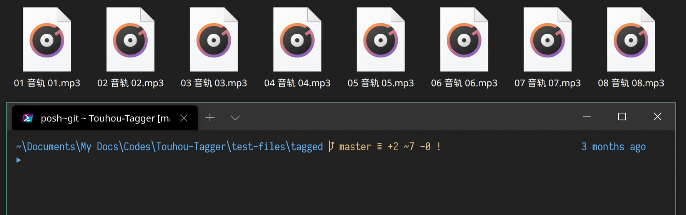
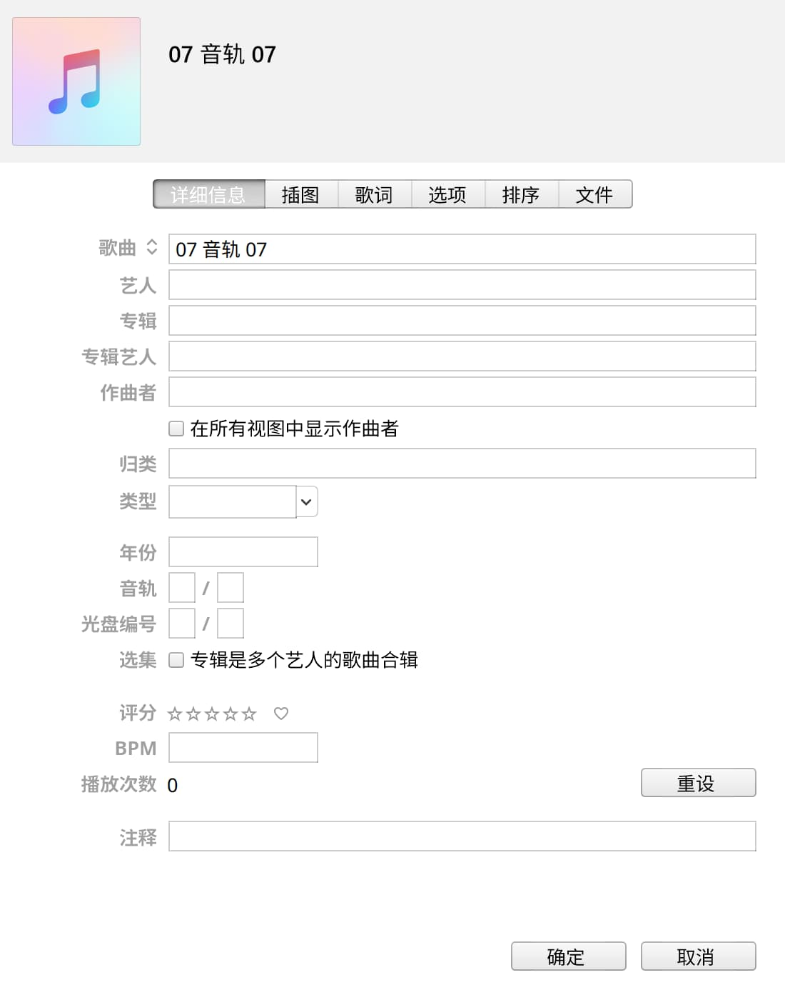
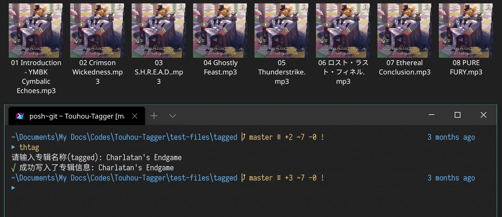
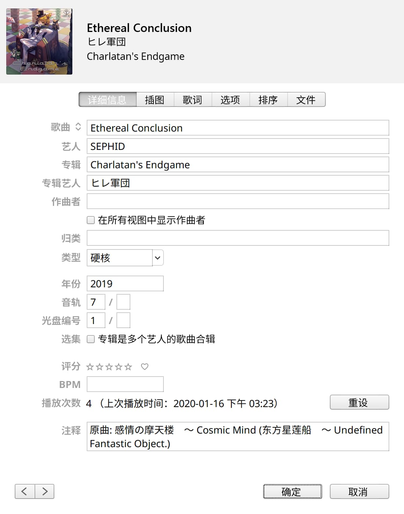

# Touhou Tagger
从 [THBWiki](http://thwiki.cc/首页) 自动填写东方 Project CD 曲目信息.

支持的曲目信息包括:
- 标题
- 作者 (Vocal + 编曲者, 原创曲时为作曲者)
- 曲目编号
- 光盘编号
- 作曲者 (通常是原创曲时出现)
- 注释 (原曲信息)
- 作词者
- 专辑名称
- 专辑排序 (使用专辑编号)
- 专辑作者 (通常为社团名称)
- 流派
- 歌词
- 发布年份
- 封面图片

## 安装 / 更新
需要事先装有 [Node.js](https://nodejs.org/en/)
然后使用以下命令来安装此工具:
```powershell
yarn global add touhou-tagger
```
没有 [yarn](https://yarnpkg.com/getting-started/install) 的话也可以用
```powershell
npm install -g touhou-tagger
```
## 使用
假设您为一个专辑的音乐建立了单独的文件夹, 在专辑文件夹中运行:
```powershell
thtag
```
启动后会询问专辑名称, 默认情况下自动取当前文件夹的名字, 如果检测到 TLMC 的命名格式则会提取其中的专辑名, 按回车表示接受自动提取的专辑名, 也可以自行输入专辑名称再按回车.

如果最后输入的名称没有**精确匹配**的专辑(**精确匹配**在 THBWiki 中表现为输入到搜索框回车能直接跳转到词条), 则会列出以此名称在 THBWiki 中的搜索结果, 可以继续选择一项作为专辑信息. (有精确匹配的话会直接开始下载专辑信息)

<details><summary><strong>图片示例</strong></summary>
<div>
  
</div>
<div>
  
</div>
<div>
  
</div>
<div>
  
</div>
</details>

## 选项
### 保存封面为单独的文件
文件名为 `cover`, 类型取决于 THBWiki 上的资源
> 如果已存在名为 `cover` 的图片, 程序会直接使用这张图, 跳过封面下载

```powershell
thtag -c
```
或
```powershell
thtag --cover
```
### 更换数据源
默认为 `thb-wiki`

```powershell
thtag -s xxx
```
或
```powershell
thtag --source xxx
```

此工具还内置了另外两种数据源:
#### local-mp3
从 MP3 文件提取曲目信息, 通常用于 FLAC 文件未填信息, 而已有填好信息的 MP3 文件. 可以使用此数据源按专辑进行信息复制.
```powershell
thtag -s local-mp3
```
在启动后, 询问专辑名称时填入 MP3 文件所在的文件夹即可.

> 注意此数据源需要填入 MP3 的文件夹路径, 因此不能用于批量模式中

#### local-json
从 JSON 文件读取曲目信息, JSON 内数据的类型为 `Metadata[]` (定义位于`src/core/metadata.ts`). 可以使用此数据源处理一些原创专辑, 用法与 `local-mp3` 基本相同.

> 如果已存在名为 `metadata.json` 的文件, 程序会直接使用其中的曲目信息, 跳过曲目信息下载. 事先在各个文件夹中准备好 `metadata.json` 的话也是可以使用批量模式的.

```powershell
thtag -s local-json
```

为了方便使用, JSON 的内容可以进行一些省略:
- 整张专辑中相同的数据, 例如专辑名称 / 社团名称等, 只需要在第一首曲目中写上即可, 后续曲目均会使用相同的数据.
- 编曲者 (artists) 和作曲者 (composers) 相同时, 可以只写作曲者. (但不能只写编曲者, 因为东方同人曲的编曲者和作曲者一般是不同的, 作曲者从原曲信息就可以推断, 所以作曲者通常是省略的. 如果只写编曲者, 程序会让作曲者留空)
- 曲目编号可以省略, 程序将自动根据书写顺序进行标注.
- CD 编号 (多 CD 专辑) 只需要在每张 CD 的第一首标注出即可, 第一张 CD 可以省略不标.

以专辑 [Heart Essence](https://www.dizzylab.net/d/AOHCD-001/#/) 为例, 实体专辑是有 2 枚 CD 的 (dizzylab 上没有注明), 从第 11 首 `Initiate the Massacre` 起实际上是来自第 2 张 CD. 可以充分发挥上面的 4 个省略方法, 编写的 `metadata.json` 内容如下:

<details><summary><strong>metadata.json 示例</strong></summary>

```json
[
  {
    "title": "Broken Display",
    "composers": [
      "ASXX"
    ],
    "album": "Heart Essence",
    "albumOrder": "AOHCD-001",
    "albumArtists": [
      "Art of Heart"
    ],
    "genres": [
      "Hard Dance"
    ],
    "year": "2021"
  },
  {
    "title": "Alarm",
    "composers": [
      "Bincente Hole"
    ]
  },
  {
    "title": "Coming Down",
    "composers": [
      "NceS"
    ]
  },
  {
    "title": "All Night",
    "composers": [
      "Agoraphobia"
    ]
  },
  {
    "title": "Faster Than Light",
    "composers": [
      "X-Eliminator"
    ]
  },
  {
    "title": "Favorite Season",
    "composers": [
      "F.BING.KAI"
    ]
  },
  {
    "title": "Dominator II",
    "composers": [
      "Danger Target"
    ]
  },
  {
    "title": "Broke My Heart",
    "composers": [
      "NoisiestLunatic"
    ]
  },
  {
    "title": "2 Hell",
    "composers": [
      "Ravenface86",
      "Baneballcore"
    ]
  },
  {
    "title": "Mud",
    "composers": [
      "_"
    ]
  },
  {
    "title": "Initiate the Massacre",
    "composers": [
      "Joulez"
    ],
    "discNumber": "2"
  },
  {
    "title": "See The Light In You",
    "composers": [
      "Koregroo"
    ]
  },
  {
    "title": "Quadrant",
    "composers": [
      "BlueWind"
    ]
  },
  {
    "title": "H.T.G",
    "composers": [
      "Mrskey"
    ]
  },
  {
    "title": "Make Your Body Shake",
    "composers": [
      "Greg Wu"
    ]
  },
  {
    "title": "Madfcuk",
    "composers": [
      "Forkyrie"
    ]
  },
  {
    "title": "Beats Indicating Tremendous Chordz & Harmonicz",
    "composers": [
      "Normal1zer"
    ]
  },
  {
    "title": "Air Lock",
    "composers": [
      "潮音きつね_H",
      "Rayven"
    ]
  },
  {
    "title": "Deranged Deities of Forsaken",
    "composers": [
      "Nirotiy"
    ]
  },
  {
    "title": "EuphoriA of My Heart",
    "composers": [
      "EuphoriA"
    ]
  }
]
```

</details>


### 下载歌词
歌词相关的处理, 除了 `--lyric` 外的选项都会自动保存.

#### 选项说明
- `-l` / `--lyric`: 启用歌词下载
- `-t` / `--lyric-type`: 歌词类型
  - **`original`(默认)**: 原版歌词
  - `translated`: 译文歌词, 没有译文时会回退到原版歌词
  - `mixed`: 混合原文和译文的歌词, 没有译文时同原版歌词
- `-o` / `--lyric-output`: 歌词输出
  - **`metadata`(默认)**: 写入到元数据中
  - `lrc`: 创建额外的`.lrc`歌词文件 (**⚠此功能尚未完善**)
- `-L` / `--no-lyric-time`: 禁用元数据歌词时轴

#### 示例
启用歌词下载, 写入原版歌词到元数据中
```powershell
thtag -l
```
启用歌词下载, 写入混合原文和译文的歌词到元数据中
```powershell
thtag -l -t mixed
```

### 禁止交互
不做任何询问, 按照理想行为运行到底, 例如:
- 专辑名称不再询问, 直接取文件夹的名称
- 根据文件夹名称搜索:
  - 搜索不到专辑时: 判为失败并退出
  - 搜索到多个专辑时: 只有一个结果就取这个结果, 否则判为失败并退出
```powershell
thtag -I
```
或
```powershell
thtag --no-interactive
```

### 批量运行
假设总的文件夹叫 `folder`, 里面有多个文件夹, 每个文件夹包含一张专辑, 文件夹名称为专辑名称
> 当前路径就在 `folder` 里的时候, 用 `thtag -b .` 就行了, `.` 表示当前文件夹

```powershell
thtag -b folder
```
或
```powershell
thtag --batch folder
```
程序会将里面的子文件夹逐个进行专辑信息获取.

#### 设置文件夹层级
如果专辑文件夹并不是直接放在 `folder` 下的, 而是有更深的层级, 可以更改批量运行时搜索文件夹的层级来获取正确的专辑文件夹列表.

例如按社团分类后, 专辑相对于 `folder` 隔了两层:
```
folder
  ├─社团1
  │  └─专辑A
  └─社团2
     └─专辑B
```

将层级设为 `2` 就可以检测到里面的专辑:
```powershell
thtag -bd 2
```
或
```powershell
thtag --batch-depth 2
```

### 超时 / 重试
默认 30 秒后无法完成专辑信息下载判定为超时, 并自动进行重试, 总尝试次数到达默认的 3 次后, 程序会判为失败并停止.

可以通过相应的开关调整以上的数值, 下面的例子为 60 秒超时, 最多试 5 次:
```powershell
thtag --timeout 60 --retry 5
```

> 这些数值更改后也会自动保存

## 特别感谢
- [THBWiki](http://thwiki.cc/首页)
- [dizzylab](https://www.dizzylab.net/)
- [foobar2000](https://www.foobar2000.org/)
- [iTunes](https://www.apple.com/itunes/)
- [Mp3Tag](https://www.mp3tag.de/en/)
